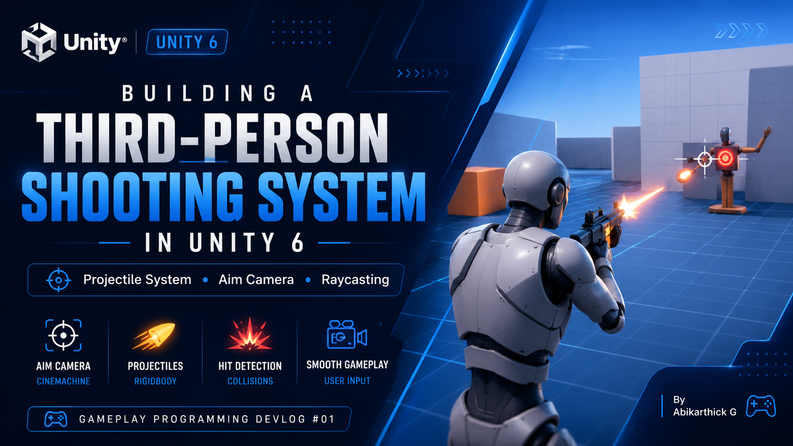
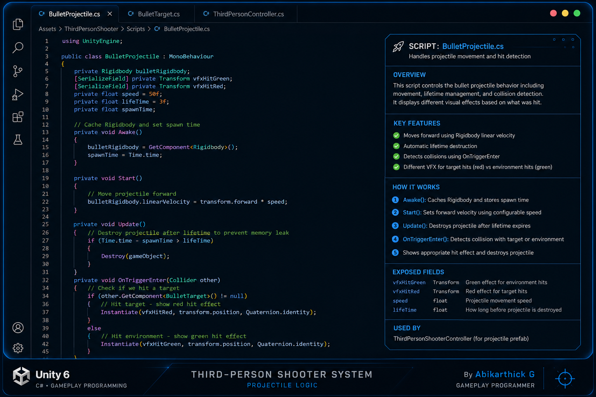
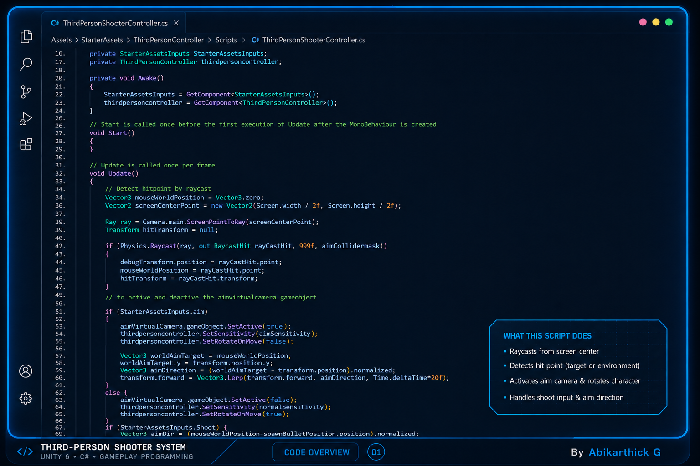

# 🎮 Third-Person Shooting System in Unity 6

A gameplay programming prototype built in **Unity 6** that demonstrates a complete third-person projectile shooting system using **C#**, **Cinemachine**, and **Unity Starter Assets**.

This project focuses on implementing core third-person shooter mechanics including aiming, projectile spawning, raycast-based target detection, character rotation, and collision effects.

---

# Preview



https://github.com/user-attachments/assets/your-video-id

> Replace the video link above after uploading `gameplay.mp4` to the repository.

---

# Features

- 🎯 Third-Person Aim Camera using Cinemachine
- 🔫 Rigidbody Projectile Shooting
- 📍 Screen-Center Raycasting
- 👤 Character Rotation Towards Aim Direction
- 💥 Different Hit Effects for Targets and Environment
- 🎮 Smooth Aim Transition
- ⚡ Integrated with Unity Starter Assets

---

# Gameplay

| Aiming | Shooting |
|---------|----------|
| Smooth aim camera transition | Projectile-based shooting |
| Character rotates towards target | Rigidbody projectile physics |
| Raycast hit detection | Collision VFX |

---

# Screenshots

## Gameplay


---

## Code Overview

### ThirdPersonShooterController.cs



Handles:

- Aim Camera Activation
- Raycasting
- Character Rotation
- Projectile Spawning
- Input Handling

---

### BulletProjectile.cs



Handles:

- Projectile Movement
- Rigidbody Physics
- Collision Detection
- Target Detection
- Hit Visual Effects

---

# Project Structure

```
Scripts/

ThirdPersonShooterController.cs
│
├── Aim Camera
├── Raycasting
├── Character Rotation
├── Shoot Input
└── Projectile Spawn

BulletProjectile.cs
│
├── Rigidbody Movement
├── Collision Detection
├── Target Detection
└── Hit Effects

ThirdPersonController.cs
│
└── Modified Unity Starter Assets Script
```

---

# Technologies Used

- Unity 6
- C#
- Cinemachine
- Unity Starter Assets
- Physics (Rigidbody)
- Raycasting

---

# Controls

| Action | Input |
|----------|---------|
| Move | WASD |
| Aim | Right Mouse Button |
| Shoot | Left Mouse Button |

---

# Learning Outcomes

This project helped me understand:

- Third-Person Camera Systems
- Cinemachine Integration
- Projectile Physics
- Raycasting
- Character Rotation
- Collision Detection
- Unity Input System
- Gameplay Programming Architecture

---

# Included Scripts

### ThirdPersonShooterController.cs

Custom gameplay controller responsible for aiming, shooting, raycasting, and projectile spawning.

---

### BulletProjectile.cs

Controls projectile movement, collision detection, and hit visual effects.

---

### ThirdPersonController.cs

A modified version of Unity Starter Assets used to support the aiming system by adding:

- Dynamic camera sensitivity
- Rotate-on-move toggle
- Better integration with the shooting mechanics

---

# Note

The player movement is based on **Unity Starter Assets**.

This repository focuses on the custom gameplay programming that was added on top of the Starter Assets framework.

---

# Future Improvements

- Object Pooling
- Damage System
- Weapon Switching
- Crosshair Spread
- Muzzle Flash
- Sound Effects
- Enemy Health System

---

# Author

**Abikarthick G**

Gameplay Programmer

---

If you found this project helpful, feel free to ⭐ the repository.
